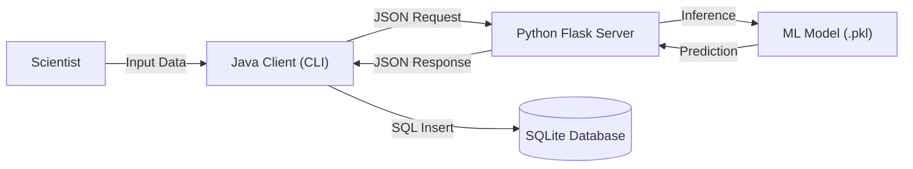

# 🐧 Antarctic Field Log (Hybrid ML System)

A full-stack field data application that integrates a Java CLI frontend with a Python Machine Learning backend.

---

## 📖 Overview

The Antarctic Field Log is a tool designed for researchers to log penguin encounters in real-time. Unlike standard data entry forms, this system includes an AI Brain.

When a scientist enters physical measurements (bill length, flipper length, etc.), the Java client sends a request to a local Python server. The server uses a trained Random Forest Classifier to instantly identify the penguin's species (Adelie, Gentoo, or Chinstrap) and returns the result to Java, where it is permanently logged in a secure database.

---

## 🏗️ System Architecture

This project demonstrates Inter-Process Communication (IPC) between two different tech stacks.


- FrontEnd: Java 17 (Console Application)
- Backend: Python (Flask REST API)
- Database: SQLite (JDBC Connection)
- AI Model: Scikit-Learn (Random Forest)

---

## ✨ Key Features

- Hybrid Integration: Seamless communication between Java and Python using java.net.http.HttpClient and JSON payloads.

- Real-time Inference: Loads a serialized Machine Learning model (penguin_brain.pkl) to provide instant species predictions.

- Robust Data Validation: Custom InputValidator module ensures no impossible biological data (e.g., negative mass) enters the system.

- Persistence: Automatically manages an SQLite database, creating tables on startup and logging every encounter for historical analysis.

- Interactive Workflow: User-friendly CLI with menu navigation, input loops, and history viewing.

---

## 📂 Project Structure

```text
antarctic-field-log/
├── src/main/java/com/antarctic/
│   ├── App.java              # Main entry point & UI Loop
│   ├── DatabaseHandler.java  # JDBC Logic (SQLite)
│   └── InputValidator.java   # Logic for data sanitization
├── app.py                    # Python Flask Server (The API)
├── penguin_brain.pkl         # Trained ML Model
├── penguin_columns.pkl       # Feature Mapping for One-Hot Encoding
├── pom.xml                   # Maven Configuration
└── antarctic_log.db          # Local Database (Auto-generated)
```
---

## 🚀 Getting Started
**Prerequisites**

- Java JDK 17 or higher.
- Python 3.8 or higher.
- Maven (optional, usually bundled with IDEs like VS Code/IntelliJ).

#### Step 1: Ignite the Brain (Python Backend)

The Java app needs the AI server to be running first.

- Navigate to the project folder.
- Install dependencies (if not already installed):
> pip install pandas scikit-learn flask joblib

- Start the server:
> python app.py

#### Step 2: Launch the Interface (Java Frontend)

- Open the folder in VS Code or IntelliJ.
- Run App.java.
- The database antarctic_log.db will be created automatically.

---
## 🎮 Usage Example

1. **Log a new Penguin:** The app will ask for measurements.
> Enter name of Island: Dream
> Enter sex: Female
> Enter Bill Length: 45.2
> Enter Bill Depth: 18.0
> Enter Flipper Length: 195
> Enter Body Mass: 3800

2.  **The AI Reponds:** The app contacts the Python server invisibly.
> Contacting AI...
> >>> AI IDENTIFIED SPECIES: Chinstrap

3. **View History:** You can select Option [3] to see all previously saved encounters from the SQLite database.
